# Integrantes

- Lorenzo Antônio Leite - RM357527
- Vitor Henrique Laia Martins - RM357177
- Fernando Caixeta do Amaral - RM357887
- Ynara Resende de Faria - RM357404

# Problema

Atualmente, a maioria dos professores e professoras da rede pública de educação não possui plataformas adequadas para postar suas aulas e transmitir conhecimento para alunos e alunas de forma prática, centralizada e tecnológica.

O backend desta aplicação já foi desenvolvido e está disponível no seguinte repositório: [Backend](https://github.com/vitorpc4/schoolpost). O frontend foi desenvolvido com base nesse backend e agora oferece uma interface web que permite aos usuários criar posts e gerenciar usuários da escola criada.

# Tecnologias

Backend: NestJS, Express, PostgreSQL
Frontend: NextJS, TailwindCSS
DevOPS: Docker, GitHub Actions

# Instalação

Instalação via Docker Compose

O Compose irá levantar três containers

- PostgreSQL
- Backend
- Frontend

```bash
# Clone o repositório
git clone https://github.com/vitorpc4/schoolpostfront.git

# Navegue até o diretório do projeto
cd schoolpostfront

# Por limitações do nextjs em tratar variáveis de ambientes, será necessário criar um arquivo
# .env.production no projeto.

NODE_ENV=production
NEXT_PUBLIC_SCHOOL_BACKEND=http://localhost:3001

#  O arquivo pode ser criado manualmente, ou executando os comandos abaixo para criação automática

# Windows Powershel

"NEXT_PUBLIC_SCHOOL_BACKEND=http://localhost:3001" | Out-File -FilePath .env.production -Force; "NODE_ENV=production" | Out-File -FilePath .env.production -Append

# Unix (Linux Ou MacOs)

echo -e "NEXT_PUBLIC_SCHOOL_BACKEND=http://localhost:3001\nNODE_ENV=production" > .env.production

# suba os containers

docker compose up -d --build
```

- Atenção, durante caso você enfrente problemas com o build sugiro que seja feito o seguinte procedimentos

```bash
# Execute
docker compose build --no-cache

# Em sequência torne a executar

docker compose up -d
```

### Modo de desenvolvimento

Atenção Para utilizar o frontend, é necessário que o backend esteja em execução. Para obtê-lo e configurá-lo corretamente, siga as instruções disponíveis no seguinte repositório

[Backend](https://github.com/vitorpc4/schoolpost)

# clone o repositório

```bash
# Clone o repositório
git clone https://github.com/vitorpc4/schoolpostfront.git

# modifique crie um arquivo .env.local e modifique as suas variáveis

echo "NEXT_PUBLIC_SCHOOL_BACKEND" > .env.local or .env.development

# Instale as dependências

npm install

# Execute o projeto

npm run dev
```

## Entrega contínua (CI/CD)

Após a conclusão do merge de um PR para a branch main, o GitHub Actions iniciará o processo de build da imagem. Após a finalização, a imagem será enviada para o Docker Hub.

Link: https://hub.docker.com/r/vitorpc4/schoolpostfront

Vale ressaltar que esse build utilizará as informações da área de Secrets do GitHub.

# Atenção:

O software adota um sistema de autenticação no qual os usuários cadastrados como professores têm acesso aos processos principais, como criação de usuários e posts. Já os alunos possuem acesso restrito, podendo apenas visualizar a área de leitura de posts.

# Instruções de uso

Para começar a utilizar a aplicação é bem simples

1. **Crie uma conta**:

Clique na opção 'Criar Conta'

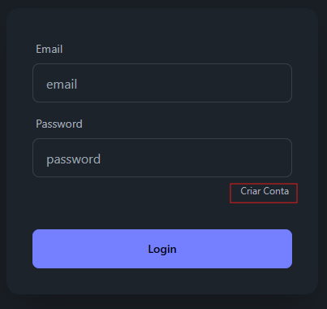

Preencha o formulário para criar sua conta e clique no botão Registrar. Após a confirmação, uma notificação será exibida indicando que a conta foi criada com sucesso, e você será automaticamente redirecionado para a tela de login.

2. **Realize o Login**:

Insira os dados de e-mail e senha no formulário e clique na opção Login. Caso as informações sejam válidas, você será automaticamente redirecionado para a página inicial do projeto.

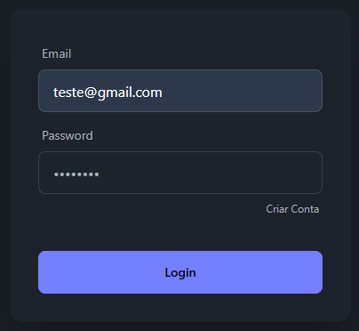

3. **Criando escola**:

Após criar sua conta, será necessário cadastrar uma escola para habilitar a criação de posts e o registro de novos usuários. Para isso, clique na opção Criar Escola e siga as instruções.

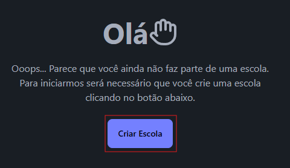

Um formulário será exibido, onde você deverá inserir um nome para representar a escola. Após concluir esse procedimento, o menu lateral, localizado no canto superior esquerdo, e a área de configurações estarão disponíveis para acesso.

4. **Cadastrando novos usuários**:

Para cadastrar novos usuários, clique no ícone de usuário localizado no canto superior direito e selecione a opção Settings. Você será redirecionado para a área de controle de usuários, onde poderá realizar o cadastro.

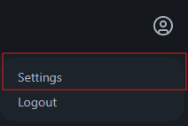

Ao acessar essa tela, clique na opção Criar Usuário e preencha o formulário com as informações necessárias. Após concluir, o novo usuário estará habilitado para realizar login no sistema.

5. **Editar ou Deletar Usuário**:

Para Editar ou Deletar um usuário clique no ícone disponível na coluna de ações da tabela.

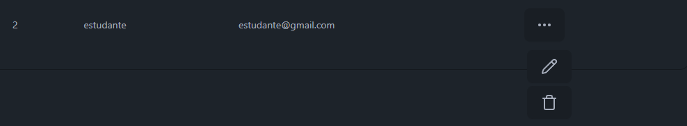

- Ao clicar em Editar, você será redirecionado para a tela de edição do post. permitindo a atualização das informações. Nesse caso, é obrigatório inserir uma nova senha.

  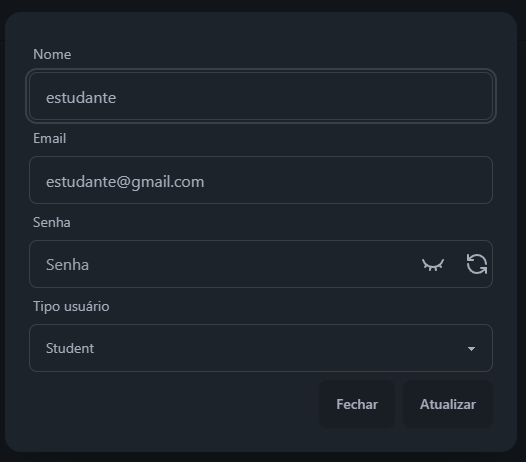

- Ao clicar em Excluir, um diálogo será exibido com a confirmação do nome do usuário que será excluído.

  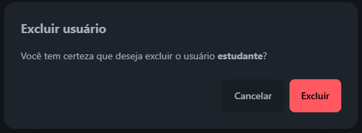

6. **Criação de Post**:

Para criar posts, acesse o menu lateral localizado no canto superior esquerdo e vá até a área de Post. Dentro dela, selecione a opção **Administração**. Nesse local, você poderá criar novos posts que serão exibidos aos usuários.

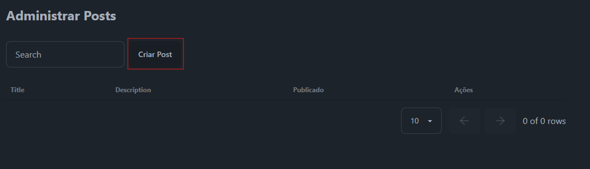

Ao acessar a área de Administração, clique na opção Criar Post e você será redirecionado para a página de criação de posts, onde encontrará um formulário para adicionar o conteúdo. O campo Autor será automaticamente vinculado ao usuário que está criando o post.

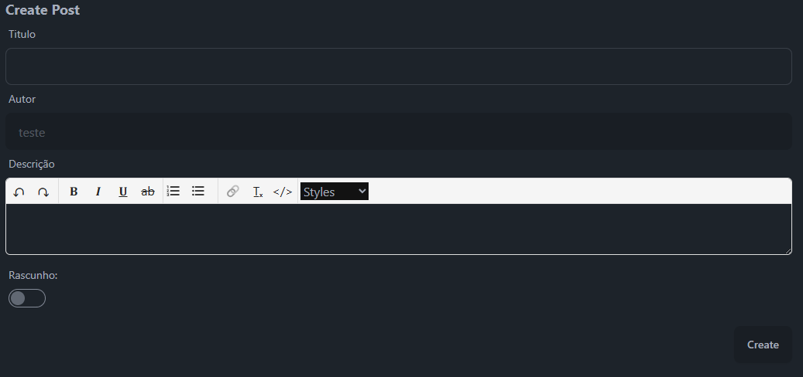

7. **Editar ou Deletar Posts**:

O processo de edição e deleção de posts segue o mesmo procedimento da área de usuários. Na coluna Ações, você encontrará um botão para cada post, permitindo editar ou deletar o conteúdo conforme necessário.

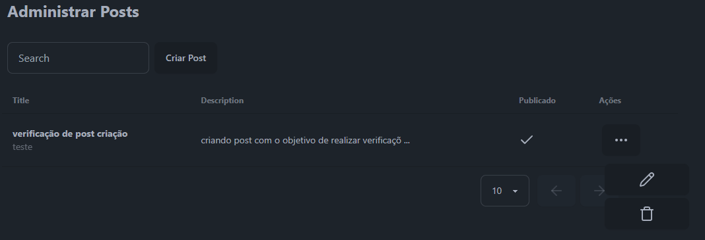

- Ao clicar em Editar, você será redirecionado para a tela de edição do post. A estrutura dessa tela é similar à da criação de posts, permitindo modificar o conteúdo conforme necessário.

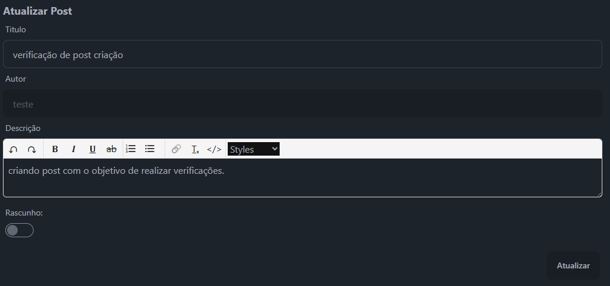

- Ao clicar em Excluir, será exibido um diálogo perguntando se o usuário tem certeza de que deseja excluir o post. O diálogo mostrará o título e o autor do post que está sendo excluído para confirmação.

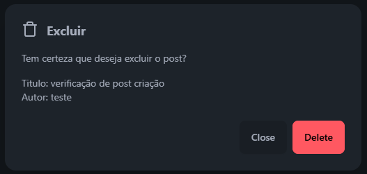

8. **Listagem e leitura de posts**:

A tela de leitura de posts é acessível tanto para alunos quanto para professores. Para acessá-la, abra o menu lateral no canto superior esquerdo, vá até a área de Posts e clique na opção Posts. Ao fazer isso, você será redirecionado para a área de leitura de posts.

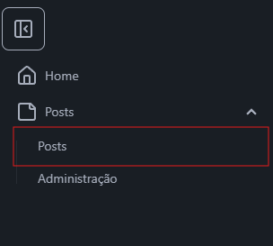

Ao clicar nessa opção, os posts existentes serão listados, e para cada post será exibido um card contendo as seguintes informações:

- Título;
- Resumo da descrição;
- Autor;
- Opção para leitura de post

  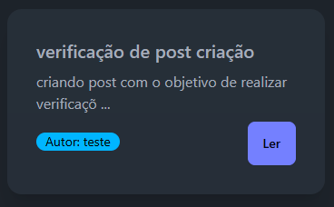

Para acessar o conteúdo completo, clique na opção **Ler**. Isso abrirá uma tela com a exibição do conteúdo do post, permitindo que o usuário leia o conteúdo na íntegra.

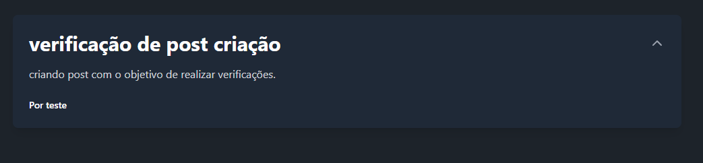

##### Com essas instruções básicas, será possível utilizar o software de forma eficiente para a distribuição de conteúdo da escola, incluindo a criação de contas, gestão de usuários, postagem de conteúdos e leitura de posts.

# Responsividade

- Vale ressaltar que o software também possui recursos de responsividade, permitindo o seu uso completo em dispositivos móveis, oferecendo uma experiência otimizada em diferentes tamanhos de tela.
